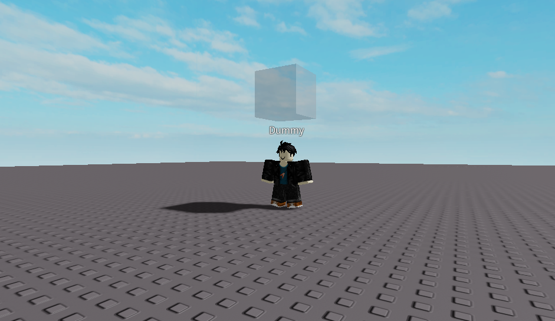

# CS460_GTAVII
First-ever GTA VII Roblox Game!

# Description
As you can tell from the title, this game is inspired by GTA V, a popular open-world action-adventure game developed by Rockstar Games.

GTA VII is set in the awesome urban landscape of downtown Boston, Massachusetts. Dive into a world of crime and speed, exploring the city landscape with custom, unique fast cars. Arm yourself with an array of amazing guns, including knives, rifles, pistols, and shotguns, offering diverse choices for combat. Experience the immersive gameplay against a backdrop of awesome seasonal-themed background music, adding depth to your adventures through the vibrant streets of Boston's criminal underworld.

Feel free to view/modify the game files yourself [here](#Installation). To play the game click [here](#Usage).

# Visuals
### Weapons Chanjewon

#### First gun 

#### Second gun 

#### Third gun 

#### Fourth gun 

#### Melee weapon 

#### Enemies

### Cars - Simon Rong

### Landscape - Peng-Lin Chen
### Boston Common

#### Roads

#### Day and night system and weather system

# Installation
To access the game files, you will need a Roblox account and Roblox Studio. The following instructions are from the Roblox Creator Hub documentation.
To install Roblox Studio:

1. Navigate to [create.roblox.com](https://create.roblox.com/) 

2. Click on the START CREATING button. A pop-up dialog displays.

  

3. Click on the DOWNLOAD STUDIO button.

  

4. Find the Studio installer in your browser's download history and double-click the file.
    - On Windows, the file is `RobloxStudio.exe.`
    - On macOS, the file is `RobloxStudio.dmg.`

5. After Studio finishes installing, a pop-up confirmation displays. Click the Launch Studio button.

6. Sign in to Studio with your Roblox account. If you don't have an account, create one at [roblox.com](https://www.roblox.com/) and follow the tips on [securing your account.](https://en.help.roblox.com/hc/en-us/articles/203313380-Account-Security-Theft-Keeping-your-Account-Safe-) 

Once you have installed Roblox Studio, you will be able to access this game files in the above files attached to this repository.

# Usage
To play this game make sure you have created a roblox account. After that you can click this link to play the game: [roblox.com/games/15554628816/GTA-VII](https://www.roblox.com/games/15554628816/GTA-VII) 

# Common Issues
There is a larger amount of lag due to the large amounts of scripts and building being rendered. What we would like to do as improvement is creating an overhead ai controller for enemies to reduce the script usage and figure out how to better render buildings within player view distance in order to improve performance. Also we needed to have had a lot more testing where we tried playing the game since there are numerous bugs, many due to lag. Overall, we would for future improvement redo and revise all the scripts and models to better decorate the map and make sure our features are working and not lagging so much.
### Weapons and Enemies
For the future, improvements would be made to all the gun scripts and animations in order to make sure they have reloading and ammo counter along with raycasting and bullet creation. I had kept them the way they were to show the improvement I had but for future work I would need to make each weapon work before I add more types. What also needs to be done is the implementation of a customization gui for weapons skins and more types of enemies.

### Cars
Due to the lag from having a massive amounts of assets in the game, sometimes car sounds can stutter and result in innacurate noises. Rare case that cars cannot be deleted. Future improvements would have better script optimization as the sounds
were sometimes too quiet or too loud, better gui to show preview of the car before spawning it.

### Landscape
In the future, improvements will be making the map bigger and having more details until it looks like a real downtown Boston. Also, I would implement my own weather system and have different wallpaper on the building with the night and day changes. For the city detail, I need to have dynamic wallpaper, sidewalks, and traffic lights.

# Acknowledgment
Special thanks to:

Chanjewon Ros: Created all weapon models including the rifles, pistol, shotgun and knife with scripts. Also created the 'dummy' models with scripts. 

Steven Chen (Peng lin chen): Created the beautiful downtown boston map and added/modified roads and building textures. Added dynamic weather system.

Simon Rong (me): Created the car models and implemented/modified scripts for sound and performance of each vehicle. Helped with building textures.

Special thanks to all the roblox youtube tutorial videos and the roblox community developer forums that helped us create this game.

We also want to shoutout the CS460 Graphics course here at Umass Boston for making this project possible. You can check out professor Haehn's CS460 Graphics course website 
here [CS460.org](https://cs460.org/)

