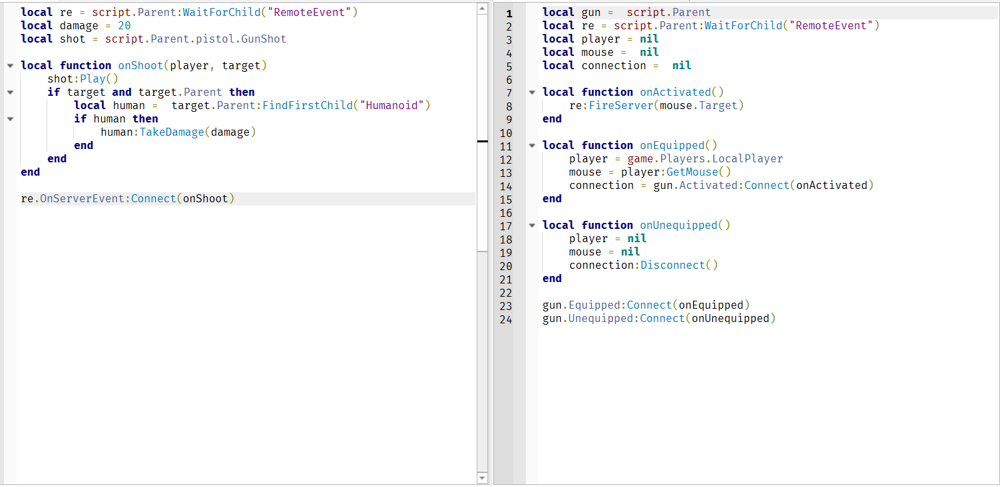

# CS460_GTAVII
First-ever GTA VII Roblox Game!

# Description
As you can tell from the title, this game is inspired by GTA V, a popular open-world action-adventure game developed by Rockstar Games.

GTA VII is set in the awesome urban landscape of downtown Boston, Massachusetts. Dive into a world of crime and speed, exploring the city landscape with custom, unique fast cars. Arm yourself with an array of amazing guns, including knives, rifles, pistols, and shotguns, offering diverse choices for combat. Experience the immersive gameplay against a backdrop of awesome seasonal-themed background music, adding depth to your adventures through the vibrant streets of Boston's criminal underworld.

Feel free to view/modify the game files yourself [here](#Installation). To play the game click [here](#Usage).

# Visuals
### Weapons Chanjewon

Here is the list of weapons, from when I first started to when I finished, with each one showing progress with my understanding of lua and scripting weapons. I was unable to introduce the skin customization that I had stated working towards in an earlier progress report since I had greatly unexpected the depth at which I would have to learn on modeling and scripting guns. 
#### First gun script

This was my first attempt and it is very basic without any projectiles that players can visually track as you can just point and click to harm enemies. The code below is the barebones of making a gun without any advance technique, such as ray casting, to track the bullet since it is just a hit scan when you click.

#### Second gun script

This revolver is the second gun I scripted having more codes for more functions as I do introduce a very small projectile that can hit enemies. I gave it a skin thinking at the time I will get towards customizing it before further working on more weapons. 

#### Third gun script

This attempt introduces raycasting an advance technique for tracking movement along with my experimentation with creating bullets that are replicaed and destroyed once used or out of rendering. 

#### Fourth gun script

This was my last gun where I continued with ray casting but didn't continue with the replicated bullets as I instead worked towards an ammo counter and reloading functions. 

#### Melee weapon scripts

#### Enemies
I was only able to create a very simple AI for the enemies where you have to get very close to 
### Cars

### Landscape

# Installation
To access the game files, you will need a Roblox account and Roblox Studio. The following instructions are from the Roblox Creator Hub documentation.
To install Roblox Studio:

1. Navigate to [create.roblox.com](https://create.roblox.com/) 

2. Click on the START CREATING button. A pop-up dialog displays.

  

3. Click on the DOWNLOAD STUDIO button.

  

4. Find the Studio installer in your browser's download history and double-click the file.
    - On Windows, the file is `RobloxStudio.exe.`
    - On macOS, the file is `RobloxStudio.dmg.`

5. After Studio finishes installing, a pop-up confirmation displays. Click the Launch Studio button.

6. Sign in to Studio with your Roblox account. If you don't have an account, create one at [roblox.com](roblox.com) and follow the tips on [securing your account.](https://en.help.roblox.com/hc/en-us/articles/203313380-Account-Security-Theft-Keeping-your-Account-Safe-) 

Once you have installed Roblox Studio, you will be able to access the game files using the Roblox Studio Launcher.

# Usage

# Common Issues
### Weapons

### Cars

### Landscape

# Acknowledgment
